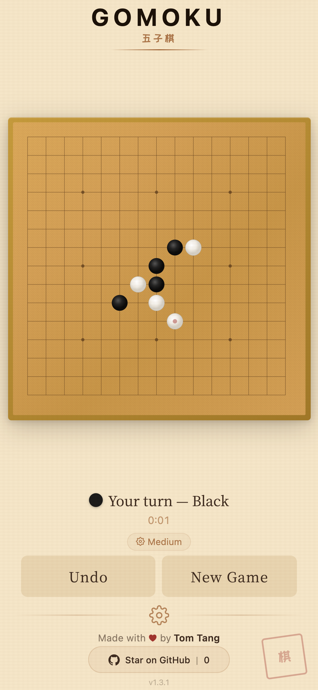
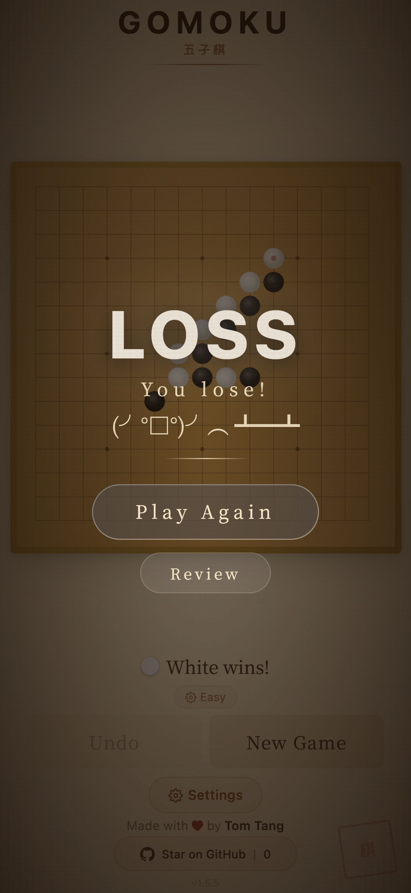
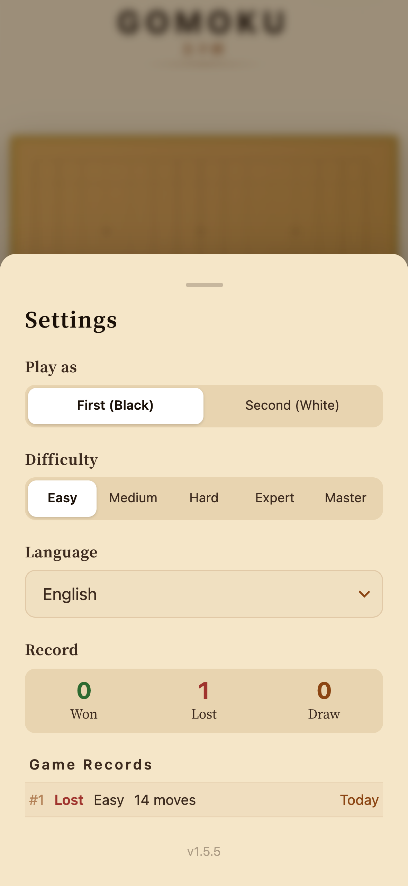
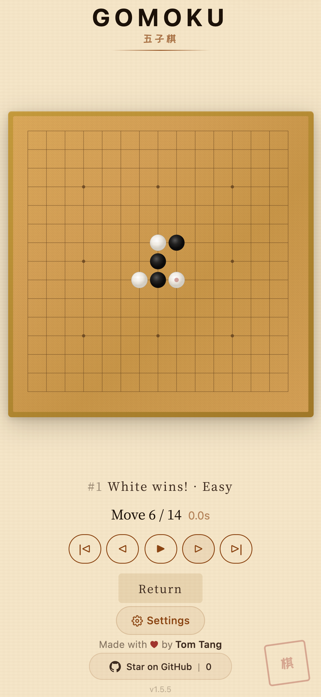

<p align="center">
  <a href="README.md">English</a> · <a href="README.zh-TW.md">繁體中文</a> · <a href="README.zh-CN.md">简体中文</a> · <a href="README.ja.md">日本語</a> · <a href="README.ko.md">한국어</a> · <a href="README.de.md">Deutsch</a> · <a href="README.es.md">Español</a> · <b>Français</b> · <a href="README.it.md">Italiano</a> · <a href="README.nl.md">Nederlands</a> · <a href="README.pt.md">Português</a>
</p>

# GOMOKU

### Peux-tu battre l'IA au plus ancien jeu de stratégie du monde ?

<p align="center">
  <a href="https://open-gomoku.pages.dev"></a>
</p>

<p align="center">
  
</p>

<p align="center">
  Gratuit. Sans inscription. Sans téléchargement. Jouez directement.
</p>

---

<table>
  <tr>
    <td align="center" width="50%">
      
      <br /><b>Partie en temps réel</b>
      <br /><sub>Chrono de tour, indicateur de réflexion IA, annuler — tout à portée de main</sub>
    </td>
    <td align="center" width="50%">
      
      <br /><b>Peux-tu gagner ?</b>
      <br /><sub>Fins dramatiques avec kaomoji animés — victoire ou défaite</sub>
    </td>
  </tr>
  <tr>
    <td align="center" width="50%">
      
      <br /><b>Personnalise tout</b>
      <br /><sub>3 niveaux de difficulté, joue Noir ou Blanc, stats V/D/N</sub>
    </td>
    <td align="center" width="50%">
      
      <br /><b>Revois chaque partie</b>
      <br /><sub>Parcours coup par coup, consulte le temps de réflexion de l'IA</sub>
    </td>
  </tr>
</table>

---

## Pourquoi celui-ci ?

- **IA invincible** — Moteur Rust compilé en WebAssembly. Moins de 100ms par coup. Bonne chance.
- **Tourne dans ton navigateur** — Pas d'appli, pas de compte. N'importe quel appareil.
- **Mobile first** — Optimisé pour le tactile. Chargement instantané.
- **11 langues** — English, 繁體中文, 简体中文, 日本語, 한국어, Deutsch, Español, Français, Italiano, Nederlands, Português.
- **Historique et rejeu** — Chaque partie sauvegardée. Revois n'importe quelle partie coup par coup.

---

<details>
<summary><b>Pour les développeurs</b></summary>
<br />

```bash
git clone https://github.com/tombelieber/gomoku.git
cd gomoku
bun install
bun run build:engine   # Compile Rust → WASM
bun run dev            # http://localhost:5173
```

**Prérequis :** [Rust](https://rustup.rs/) · [Bun](https://bun.sh) · [wasm-pack](https://rustwasm.github.io/wasm-pack/installer/)

| Couche | Technologie |
|--------|-------------|
| Moteur | Rust, WebAssembly, wasm-pack |
| Frontend | React 19, TypeScript, Zustand, Vite |
| Hébergement | Cloudflare Pages |

Voir [CONTRIBUTING.md](CONTRIBUTING.md) et [ARCHITECTURE.md](docs/ARCHITECTURE.md) pour plus de détails.

</details>

---

<p align="center">
  
  
  
</p>

<p align="center">
  <a href="https://github.com/tombelieber/gomoku">Étoile sur GitHub</a> · <a href="https://open-gomoku.pages.dev">open-gomoku.pages.dev</a> · MIT License · Créé par <a href="https://github.com/tombelieber">Tom Tang</a>
</p>
