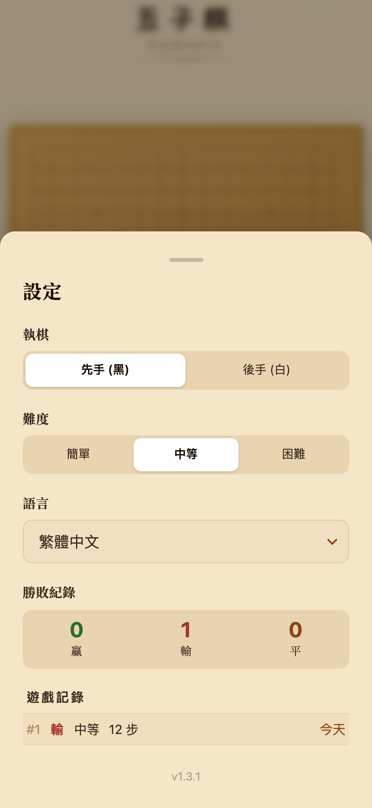
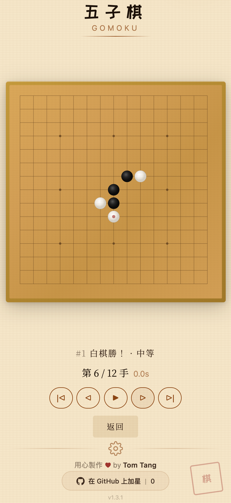

<p align="center">
  <b>English</b> · <a href="README.zh-TW.md">繁體中文</a> · <a href="README.zh-CN.md">简体中文</a> · <a href="README.ja.md">日本語</a> · <a href="README.ko.md">한국어</a> · <a href="README.de.md">Deutsch</a> · <a href="README.es.md">Español</a> · <a href="README.fr.md">Français</a> · <a href="README.it.md">Italiano</a> · <a href="README.nl.md">Nederlands</a> · <a href="README.pt.md">Português</a>
</p>

# GOMOKU

### Think you can beat an AI at the world's oldest strategy game?

<p align="center">
  <a href="https://open-gomoku.pages.dev"></a>
</p>

https://github.com/user-attachments/assets/432a75ab-832d-4c30-bd60-d53037197331

<p align="center">
  Free. No signup. No download. Just play.
</p>

---

<table>
  <tr>
    <td align="center" width="50%">
      
      <br /><b>Real-time Gameplay</b>
      <br /><sub>Turn timer, AI thinking indicator, undo — all at your fingertips</sub>
    </td>
    <td align="center" width="50%">
      
      <br /><b>Can You Beat the AI?</b>
      <br /><sub>Dramatic endings with animated kaomoji — win or lose</sub>
    </td>
  </tr>
  <tr>
    <td align="center" width="50%">
      
      <br /><b>Customize Everything</b>
      <br /><sub>3 difficulty levels, play as Black or White, W/L/D stats</sub>
    </td>
    <td align="center" width="50%">
      
      <br /><b>Review Any Game</b>
      <br /><sub>Step through moves, see AI thinking time</sub>
    </td>
  </tr>
</table>

---

## Why This One?

- **Unbeatable AI** — Rust-powered engine compiled to WebAssembly. Sub-100ms moves. Good luck.
- **Runs in your browser** — No app to install, no account to create. Works on any device.
- **Mobile-first** — Touch-optimized for phones and tablets. Instant load.
- **11 languages** — English, 繁體中文, 简体中文, 日本語, 한국어, Deutsch, Español, Français, Italiano, Nederlands, Português.
- **Game history & replay** — Every game saved. Step through any past match move-by-move.

---

<details>
<summary><b>For Developers</b></summary>
<br />

```bash
git clone https://github.com/tombelieber/gomoku.git
cd gomoku
bun install
bun run build:engine   # Compile Rust → WASM
bun run dev            # http://localhost:5173
```

**Prerequisites:** [Rust](https://rustup.rs/) · [Bun](https://bun.sh) · [wasm-pack](https://rustwasm.github.io/wasm-pack/installer/)

| Layer | Tech |
|-------|------|
| Engine | Rust, WebAssembly, wasm-pack |
| Frontend | React 19, TypeScript, Zustand, Vite |
| Hosting | Cloudflare Pages |

See [CONTRIBUTING.md](CONTRIBUTING.md) and [ARCHITECTURE.md](docs/ARCHITECTURE.md) for deep dives.

</details>

---

<p align="center">
  
  
  
</p>

<p align="center">
  <a href="https://github.com/tombelieber/gomoku">Star on GitHub</a> · <a href="https://open-gomoku.pages.dev">open-gomoku.pages.dev</a> · MIT License · Made by <a href="https://github.com/tombelieber">Tom Tang</a>
</p>
