# open-gomoku

> The classic board game, reimagined for the browser. Free, beautiful, and unbeatable AI — in 11 languages.

<p align="center">
  <a href="https://open-gomoku.pages.dev"><strong>Play Now</strong></a>
</p>

<p align="center">
  
</p>

<p align="center">
  
  
  
  
  
</p>

---

## Gameplay

Play as Black or White against a Rust-powered AI with three difficulty levels. Every move is computed in under 100ms via WebAssembly.

<p align="center">
  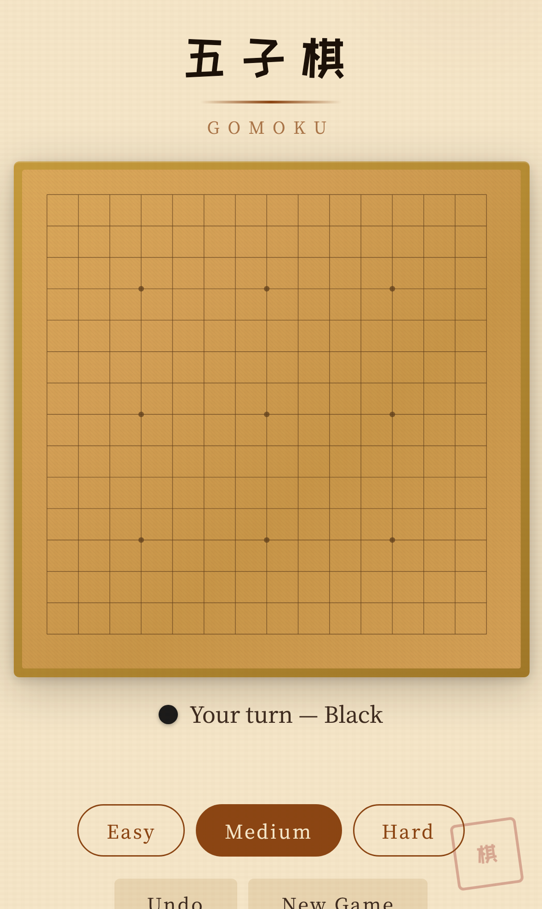
  &nbsp;&nbsp;
  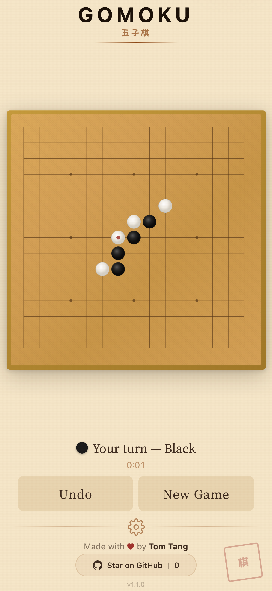
  &nbsp;&nbsp;
  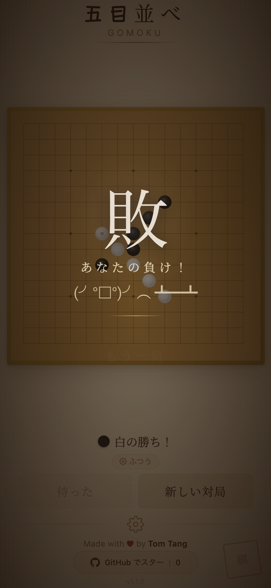
</p>

---

## Features

| | |
|---|---|
| **Unbeatable AI** | Minimax with alpha-beta pruning, running as compiled Rust → WebAssembly |
| **3 Difficulty Levels** | Easy, Medium, Hard — adapt the challenge to your skill |
| **Play as Black or White** | Choose your side, or switch mid-session in Settings |
| **Game History** | All games saved locally with W/L/D records |
| **Move-by-Move Replay** | Step through any past game to study your moves |
| **Win/Loss/Draw Stats** | Track your performance over time |
| **Undo** | Take back your last move |
| **Mobile-First** | Touch-optimized, fully playable on phones and tablets |
| **Instant Load** | No server, no signup — runs entirely in your browser |
| **11 Languages** | English, 简体中文, 繁體中文, 日本語, 한국어, Deutsch, Español, Français, Italiano, Nederlands, Português |

---

## 11 Languages

Every string is localized. Switch languages instantly from the settings drawer.

<table>
  <tr>
    <td align="center">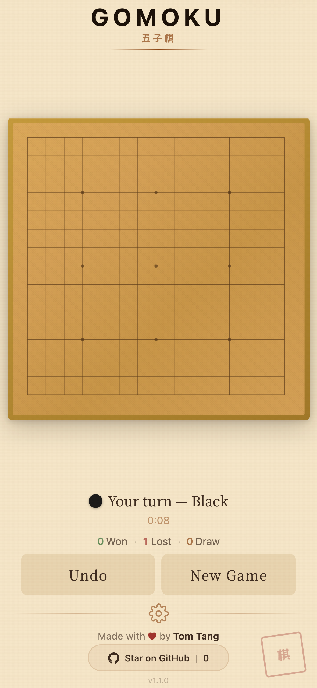<br /><b>English</b></td>
    <td align="center">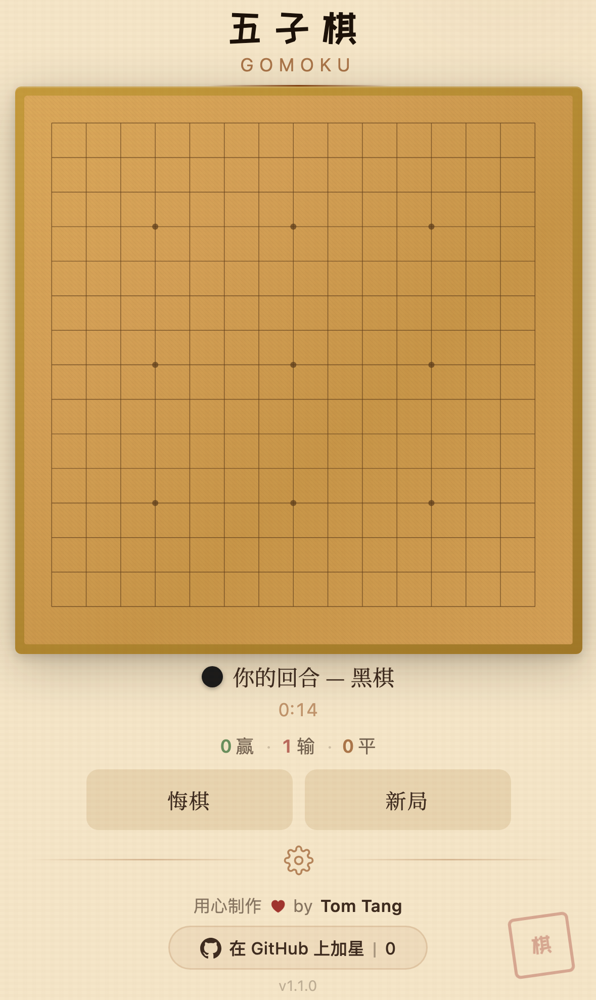<br /><b>简体中文</b></td>
    <td align="center">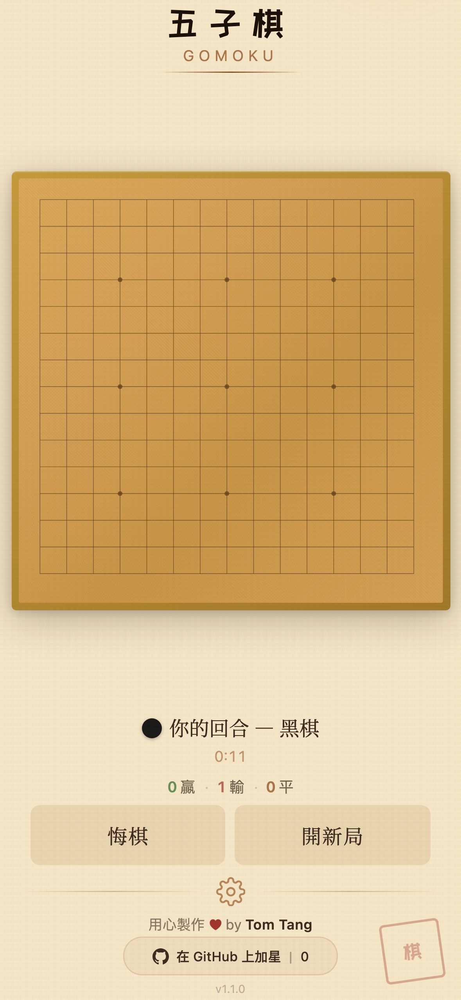<br /><b>繁體中文</b></td>
    <td align="center"><br /><b>日本語</b></td>
  </tr>
  <tr>
    <td align="center">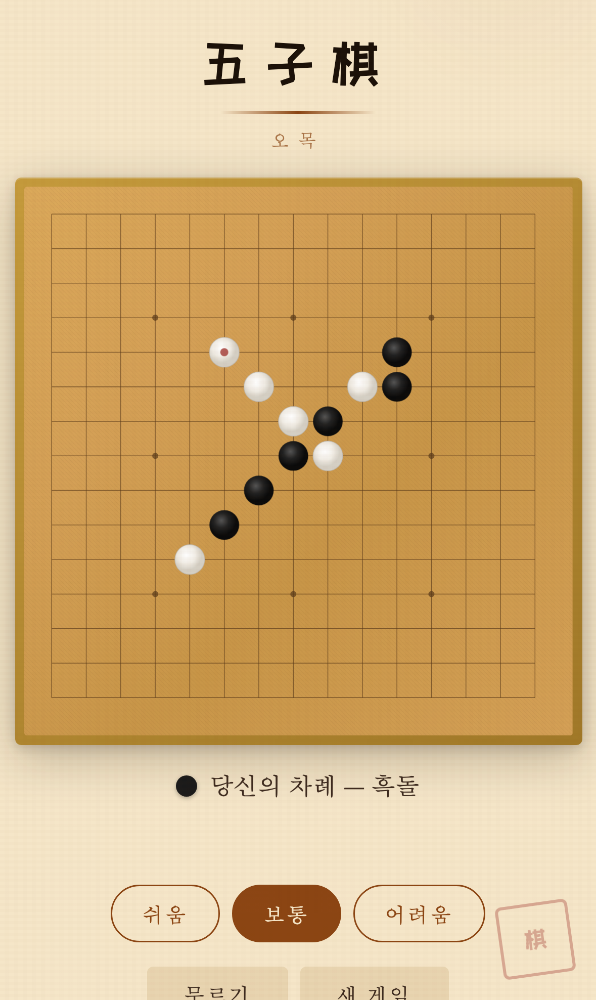<br /><b>한국어</b></td>
    <td align="center">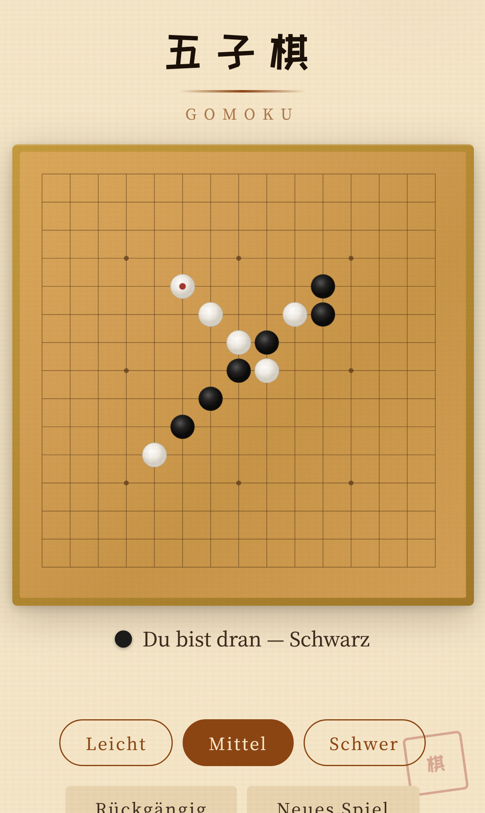<br /><b>Deutsch</b></td>
    <td align="center"><br /><b>Español</b></td>
    <td align="center">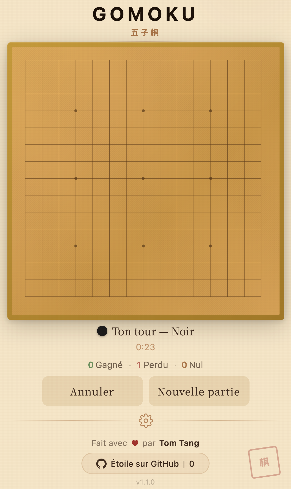<br /><b>Français</b></td>
  </tr>
  <tr>
    <td align="center">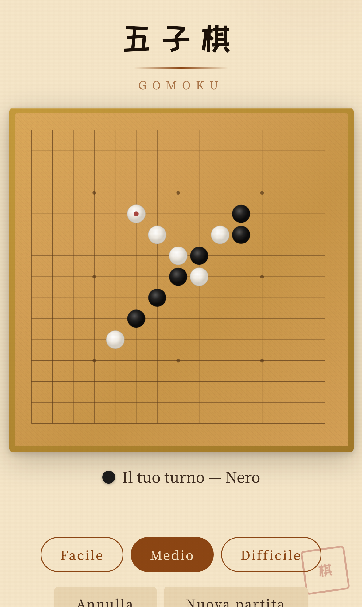<br /><b>Italiano</b></td>
    <td align="center">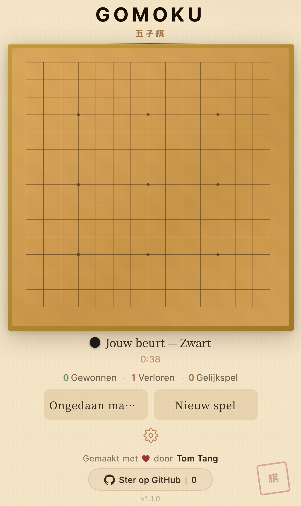<br /><b>Nederlands</b></td>
    <td align="center">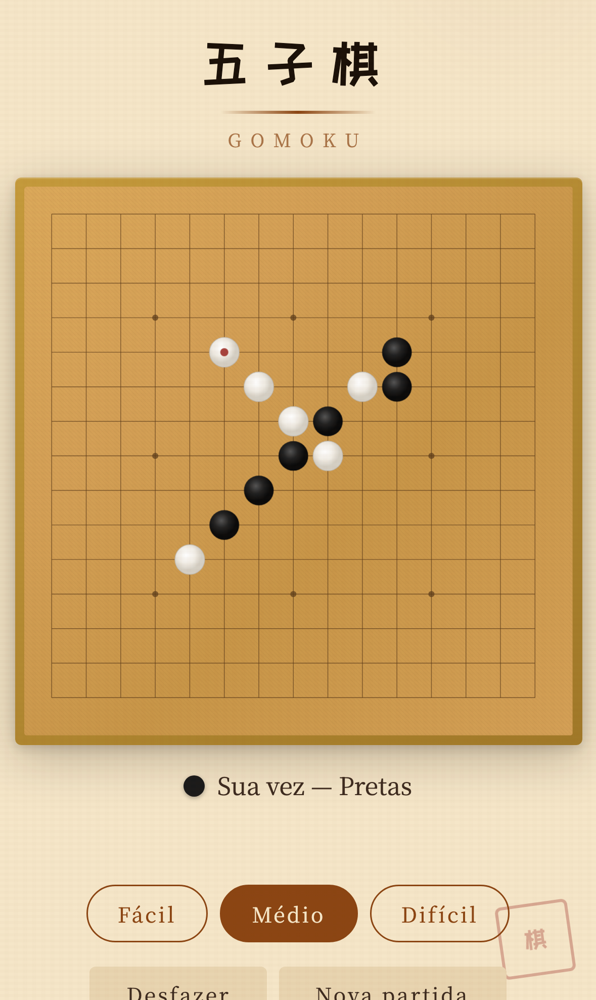<br /><b>Português</b></td>
    <td></td>
  </tr>
</table>

---

## How It Works

```
  React 19 + TypeScript        Web Worker           Rust → WebAssembly
┌───────────────────────┐   ┌──────────────┐   ┌──────────────────────┐
│  UI · State · i18n    │──▶│  Background  │──▶│  Minimax + Alpha-    │
│  Touch · History      │◀──│  Thread      │◀──│  Beta Pruning        │
└───────────────────────┘   └──────────────┘   └──────────────────────┘
       Your screen            Non-blocking          <100ms per move
```

The AI runs in a Web Worker so the UI never freezes — even on mobile. The Rust engine compiles to WASM for near-native speed in the browser.

---

## For Developers

### Quick Start

```bash
git clone https://github.com/tombelieber/gomoku.git
cd gomoku
bun install
bun run build:engine   # Compile Rust → WASM
bun run dev            # http://localhost:5173
```

**Prerequisites:** [Rust](https://rustup.rs/) · [Bun](https://bun.sh) · [wasm-pack](https://rustwasm.github.io/wasm-pack/installer/)

### Go Deeper

| Doc | What's inside |
|-----|---------------|
| [**CONTRIBUTING.md**](CONTRIBUTING.md) | Dev setup, project structure, how to extend the game, code style |
| [**docs/ARCHITECTURE.md**](docs/ARCHITECTURE.md) | AI algorithm deep-dive, WASM integration, evaluation function, design decisions |

---

## Tech Stack

| Layer | Technology |
|-------|-----------|
| Engine | Rust, WebAssembly, wasm-pack |
| Frontend | React 19, TypeScript, Zustand |
| Build | Vite, Bun |
| i18n | Custom lightweight system (11 locales, zero dependencies) |
| Hosting | Cloudflare Pages |

---

## License

[MIT](LICENSE) — free to use, modify, and distribute.

---

<p align="center">
  Made with <a href="https://github.com/tombelieber">Tom Tang</a>
  <br />
  <a href="https://github.com/tombelieber/gomoku">Star on GitHub</a>
</p>
