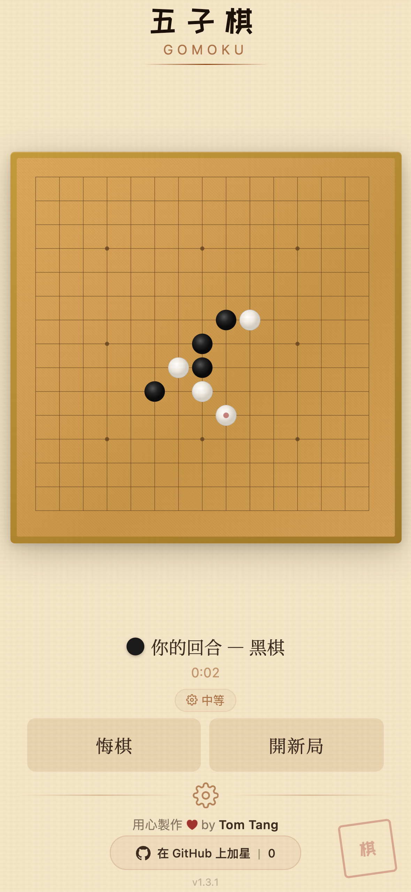

<p align="center">
  <a href="README.md">English</a> · <b>繁體中文</b> · <a href="README.zh-CN.md">简体中文</a> · <a href="README.ja.md">日本語</a> · <a href="README.ko.md">한국어</a> · <a href="README.de.md">Deutsch</a> · <a href="README.es.md">Español</a> · <a href="README.fr.md">Français</a> · <a href="README.it.md">Italiano</a> · <a href="README.nl.md">Nederlands</a> · <a href="README.pt.md">Português</a>
</p>

# 五子棋

### 你能打敗 AI 嗎？來挑戰世界上最古老的策略遊戲

<p align="center">
  <a href="https://open-gomoku.pages.dev"></a>
</p>

<p align="center">
  
</p>

<p align="center">
  免費。無需註冊。無需下載。直接開玩。
</p>

---

<table>
  <tr>
    <td align="center" width="50%">
      
      <br /><b>即時對弈</b>
      <br /><sub>回合計時、AI 思考指示、悔棋 — 盡在掌中</sub>
    </td>
    <td align="center" width="50%">
      
      <br /><b>你能贏嗎？</b>
      <br /><sub>戲劇性的結局配上動態顏文字 — 勝或敗</sub>
    </td>
  </tr>
  <tr>
    <td align="center" width="50%">
      
      <br /><b>自訂一切</b>
      <br /><sub>3 種難度、選擇執黑或執白、勝/負/和統計</sub>
    </td>
    <td align="center" width="50%">
      
      <br /><b>回顧任何棋局</b>
      <br /><sub>逐步瀏覽每一手，查看 AI 思考時間</sub>
    </td>
  </tr>
</table>

---

## 為什麼選這個？

- **無敵 AI** — Rust 引擎編譯為 WebAssembly，每手不到 100 毫秒。祝你好運。
- **瀏覽器直接跑** — 無需安裝 App，無需建立帳號。任何裝置都能玩。
- **行動裝置優先** — 為觸控操作優化的介面。瞬間載入。
- **11 種語言** — English, 繁體中文, 简体中文, 日本語, 한국어, Deutsch, Español, Français, Italiano, Nederlands, Português.
- **對局歷史與回放** — 每盤棋自動儲存。逐步回顧任何一場對局。

---

<details>
<summary><b>開發者資訊</b></summary>
<br />

```bash
git clone https://github.com/tombelieber/gomoku.git
cd gomoku
bun install
bun run build:engine   # Compile Rust → WASM
bun run dev            # http://localhost:5173
```

**必要條件：** [Rust](https://rustup.rs/) · [Bun](https://bun.sh) · [wasm-pack](https://rustwasm.github.io/wasm-pack/installer/)

| 層級 | 技術 |
|------|------|
| 引擎 | Rust, WebAssembly, wasm-pack |
| 前端 | React 19, TypeScript, Zustand, Vite |
| 部署 | Cloudflare Pages |

詳見 [CONTRIBUTING.md](CONTRIBUTING.md) 和 [ARCHITECTURE.md](docs/ARCHITECTURE.md)。

</details>

---

<p align="center">
  
  
  
</p>

<p align="center">
  <a href="https://github.com/tombelieber/gomoku">在 GitHub 上加星</a> · <a href="https://open-gomoku.pages.dev">open-gomoku.pages.dev</a> · MIT License · 由 <a href="https://github.com/tombelieber">Tom Tang</a> 製作
</p>
